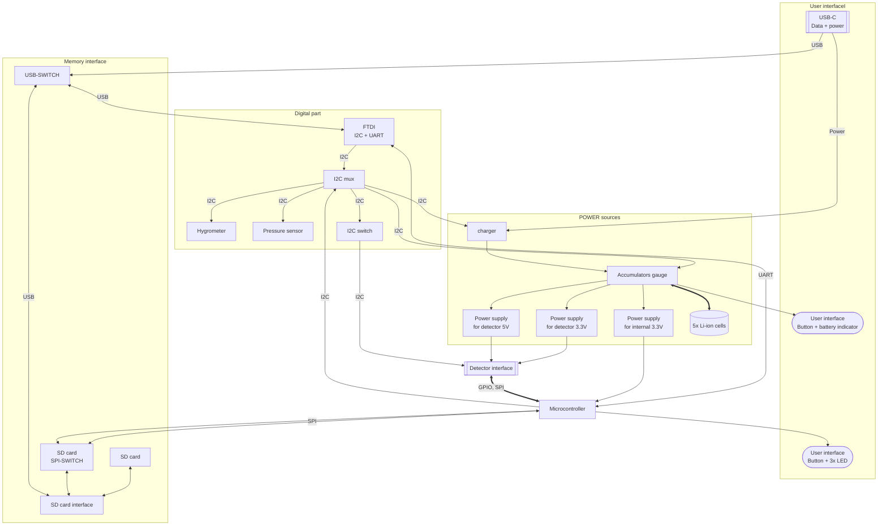

# BATDATUNIT01 - Power and Data Storage Module

The BATDATUNIT01 is power and data storage module incorporating an ATmea1284p microcontroller paired with a five 18650 Li-ion safely rechargable accumulator cells. It is a reliable power source for extended durations, making it an integral component in various detectors or measuring systems.

## Features

- **Microcontroller**: [ATmega1284p](https://www.microchip.com/wwwproducts/en/ATmega1284p) provides robust processing capabilities to manage complex tasks efficiently.
- **Battery Pack**: A Set of up to five Li-ion batteries offers substantial power, facilitating long-term operations without frequent recharging.
- **USB-C Charging**: Enables hassle-free charging with a USB-C interface, ensuring the module is readily powered for sustained use.
- **Charging and Monitoring Circuits**: The [BQ25628E](https://www.ti.com/product/BQ25628) circuit oversees the charging, while the [BQ34Z100](https://www.ti.com/product/BQ34Z100) gauge monitors the battery state for optimal energy management.

## Applications

The BATDATUNIT01 is designed for versatility:

- As a **power module for semiconductor particle detectors** like the [AIRDOS04](https://github.com/UniversalScientificTechnologies/AIRDOS04), it ensures uninterrupted data acquisition in environmental monitoring.
- It can be integrated into **remote sensing stations**, providing consistent power and data logging capabilities for long-term ecological studies.
- In **automated weather stations**, the module's resilience and sensor suite offers valuable insights into meteorological conditions.
- The module can be deployed in **mobile robotics** for energy supply and environmental data collection, aiding navigation and decision-making processes.
- It is also ideal for **educational purposes**, as a hands-on tool to teach about energy management, data acquisition, and sensor integration.

The robust design and connectivity options make the BATDATUNIT01 a dependable choice for powering and managing data across many scientific applications.

For more detailed information on interfacing and protocols, please refer to the [ATmea1284p datasheet](https://ww1.microchip.com/downloads/en/DeviceDoc/doc8059.pdf) and the communication standards for [UART](https://en.wikipedia.org/wiki/Universal_asynchronous_receiver-transmitter), [I2C](https://www.i2c-bus.org/), [SPI](https://en.wikipedia.org/wiki/Serial_Peripheral_Interface), and [GPIO](https://en.wikipedia.org/wiki/General-purpose_input/output).

## Design

Designed for convenience, the module allows for fast detachment from the measuring part without tools, streamlining the replacement process. Data can be downloaded during battery charging thanks to onboard memory.

## Schematics

### Internal structure

## Connectivity

A durable Molex connector brings together data and detection with impressive mechanical resilience. It hosts UART, I2C, SPI buses, and extra GPIO signals, providing extensive interfacing options with various systems. The complementary module to the interface connector is [BATDATSOCKET01](https://github.com/mlab-modules/BATDATSOCKET01).

